# Spring 부트캠프 클라우드 과제

## Lv0. budgets 설정
- 80% 설정되어 있음
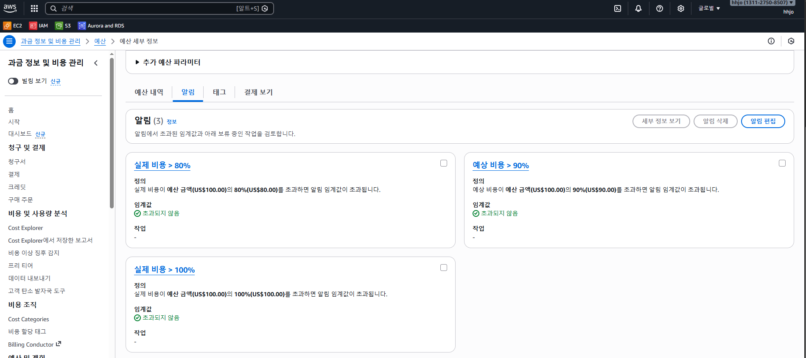
- 이메일 설정되어 있음
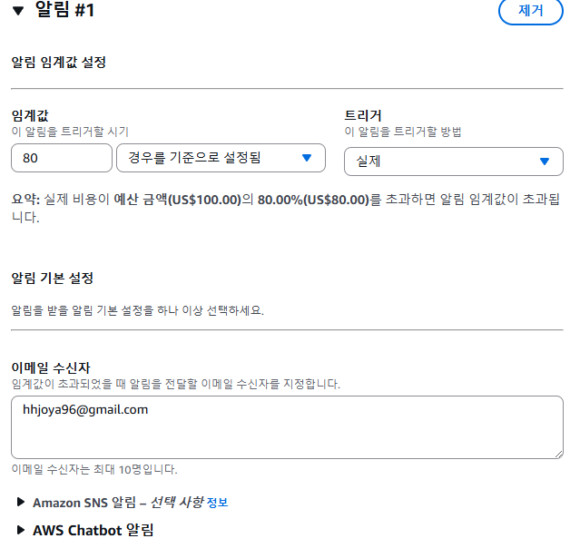

## Lv1. 인프라 구축 및 애플리케이션 개발
- VPC 및 EC2 생성
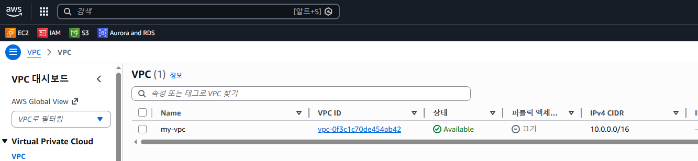
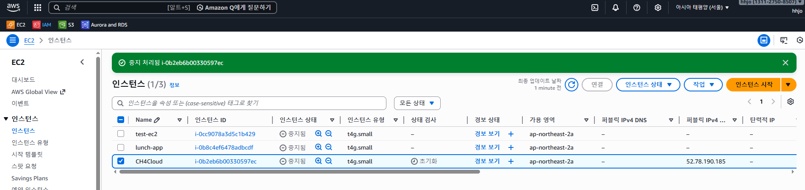

- 애플리케이션 개발
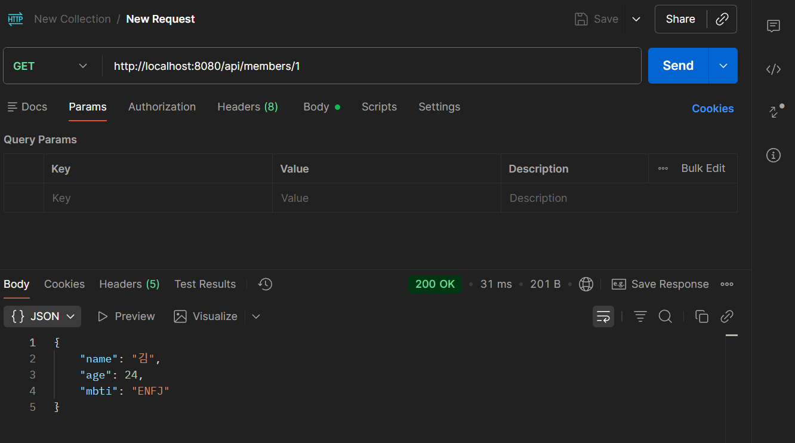

- 운영 설정(local, prod 분리)

- 로그 전략
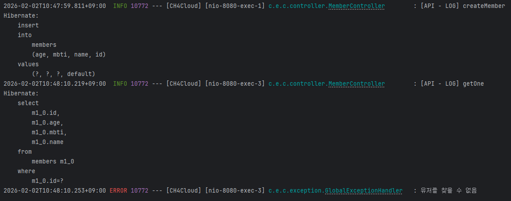

- actuator 추가
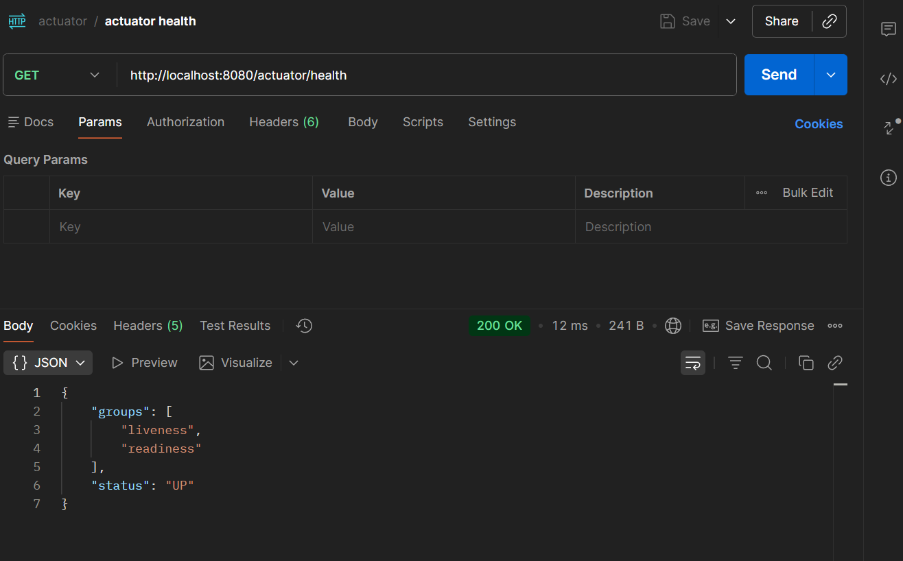

- 서버 실행
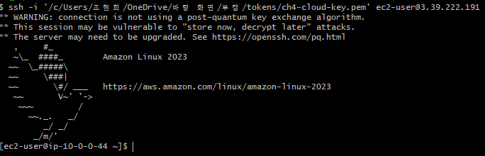
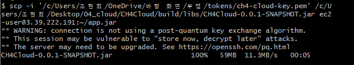
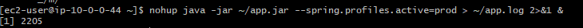

### 요구사항
서버 IP 3.39.222.191

## LV2 db분리 및 보안

- 스프링 실행
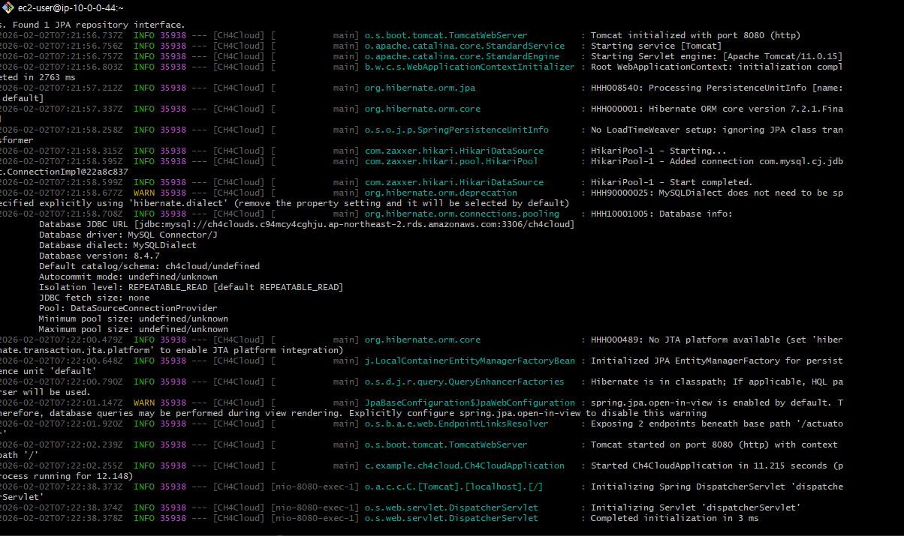

### 요구사항
- 보안 그룹 설정
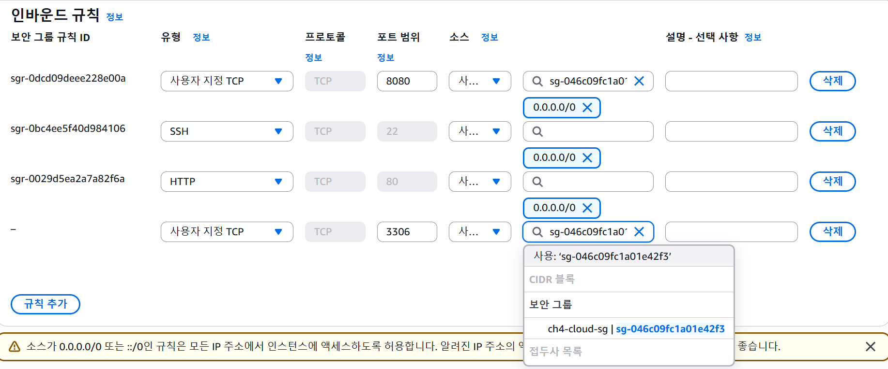

- 엔드포인트 url: http://3.39.222.191:8080/actuator/info
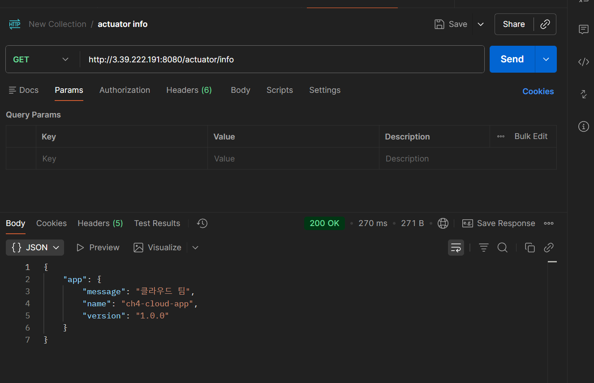

## LV3 S3
- 퍼블릭 엑세스 차단

- 로컬 파일 업로드, 다운로드 확인
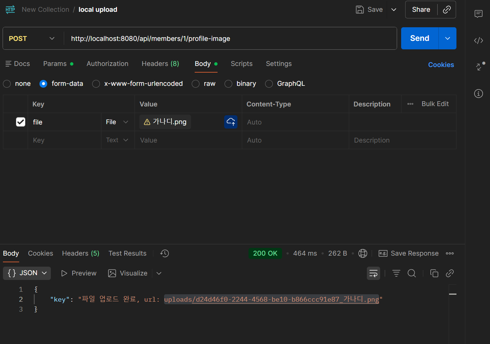
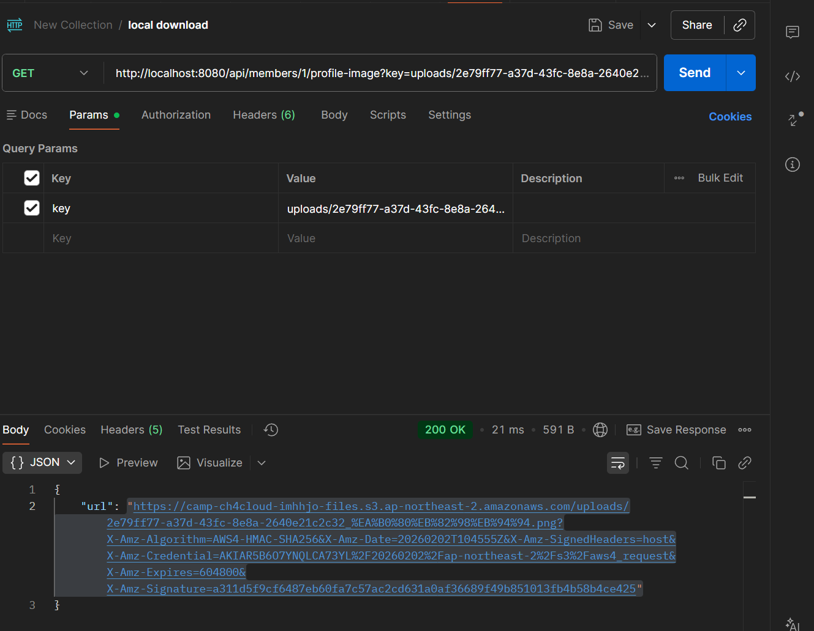

- 서버 파일 업로드, 다운로드 확인
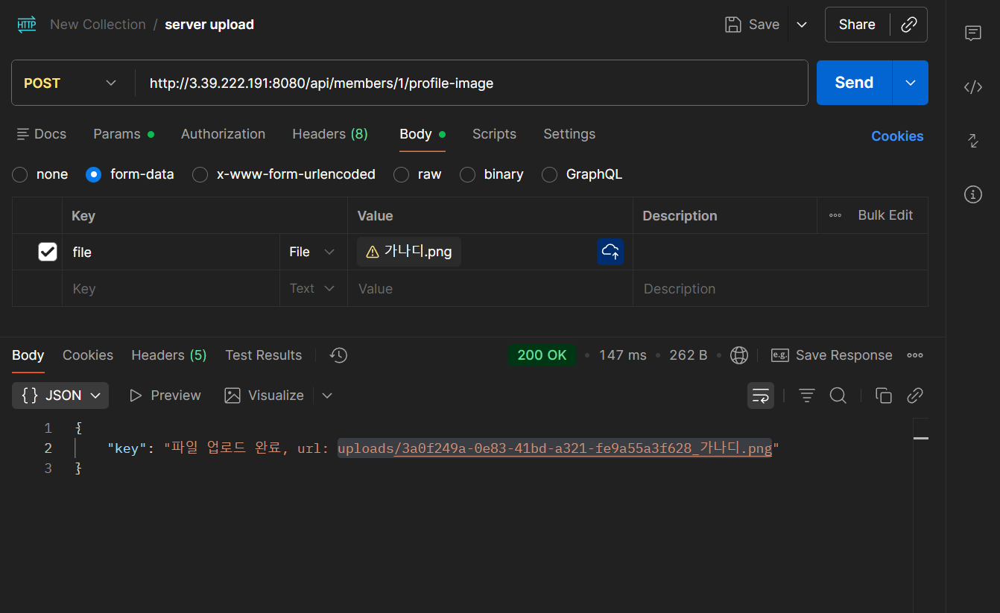
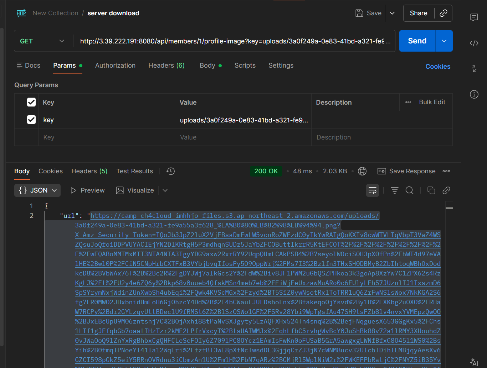

- 버켓 확인
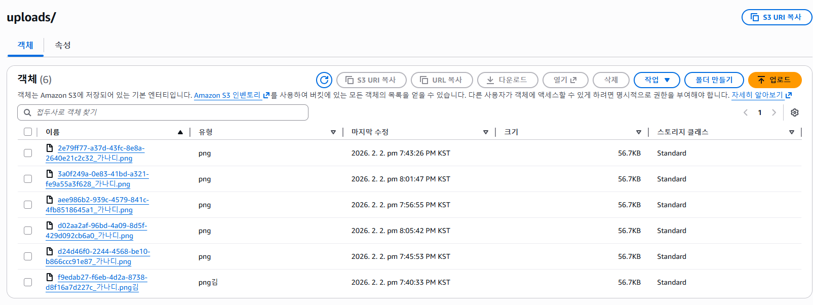

### 요구사항
url: 
만료: 